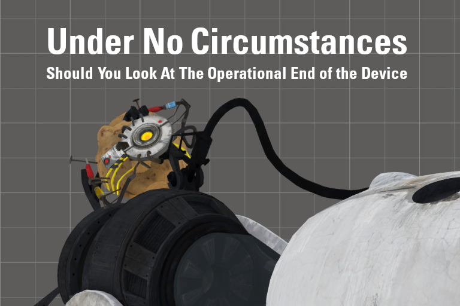

  <picture>
    
  </picture>

Safety first.

  <picture>
    
  </picture>

# Contents
This repository contains the source files used to make the P2:CE addon _Under No Circumstances Should You Look At The Operational End of the Device_ (UNCSYLATOEotD). It replaces the crappy portal gun lowered animations (and transitions) with a completely reanimated version, from yours truly.

Includes SFM project sources (and accompanying taunt export DMXs for the viewmodel) and QC for any model replacements.

All source files associated with this reanimation are licensed under CC0; original portal gun files belong to Valve.